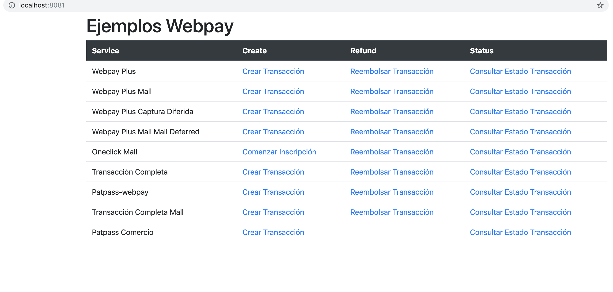
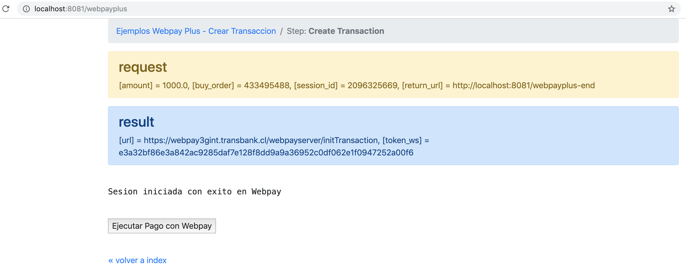
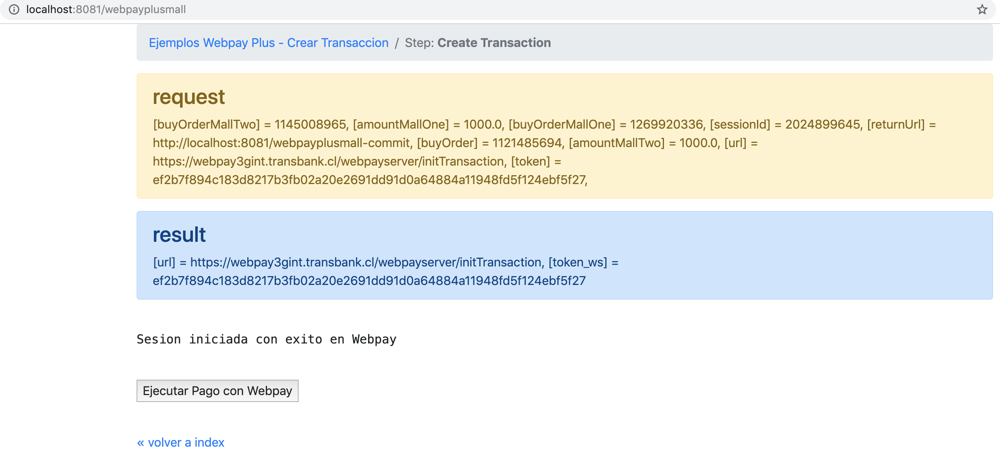
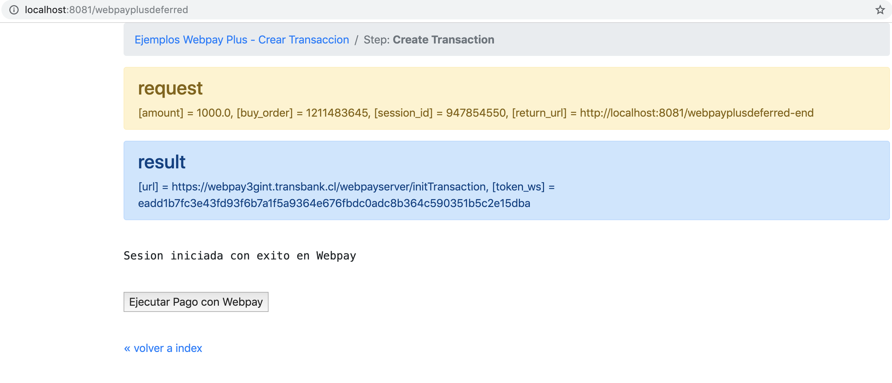
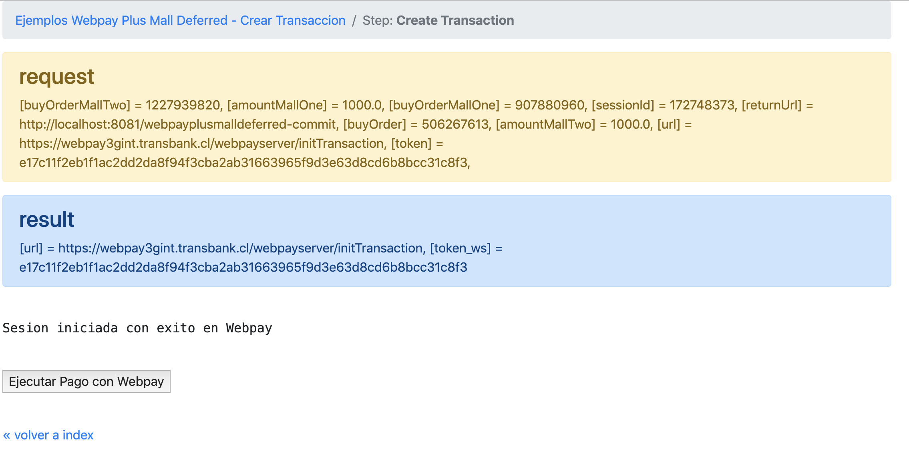
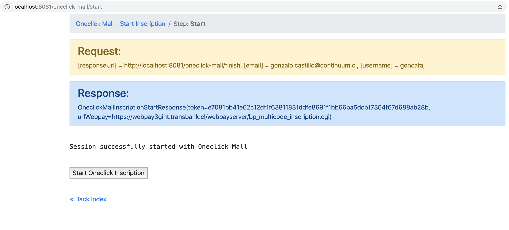
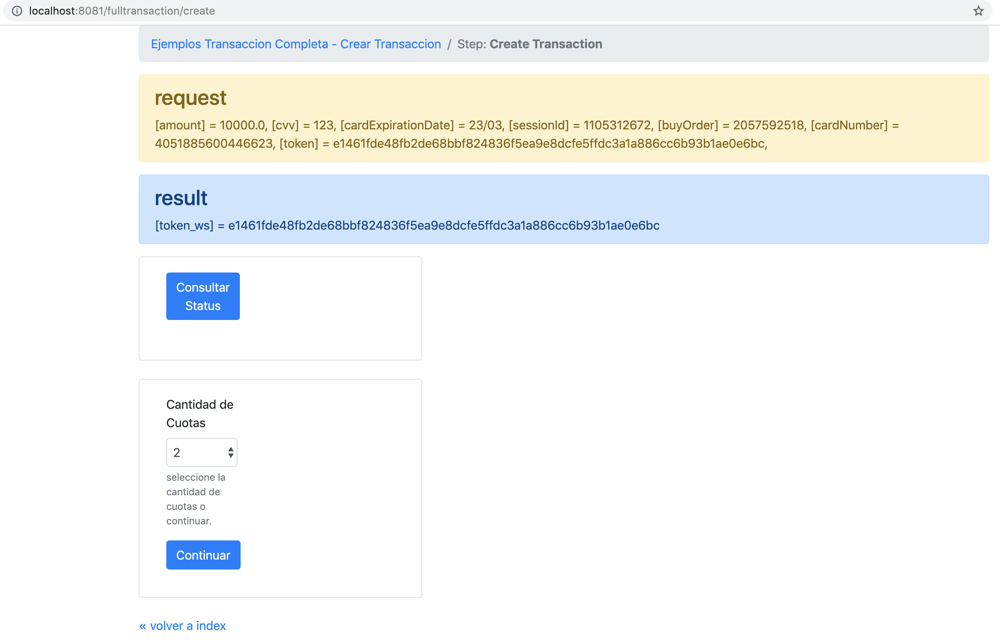
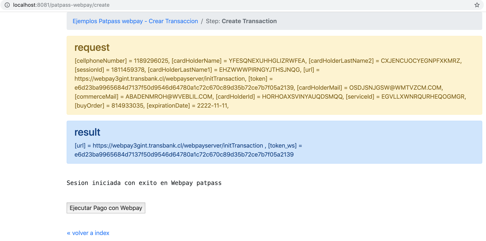
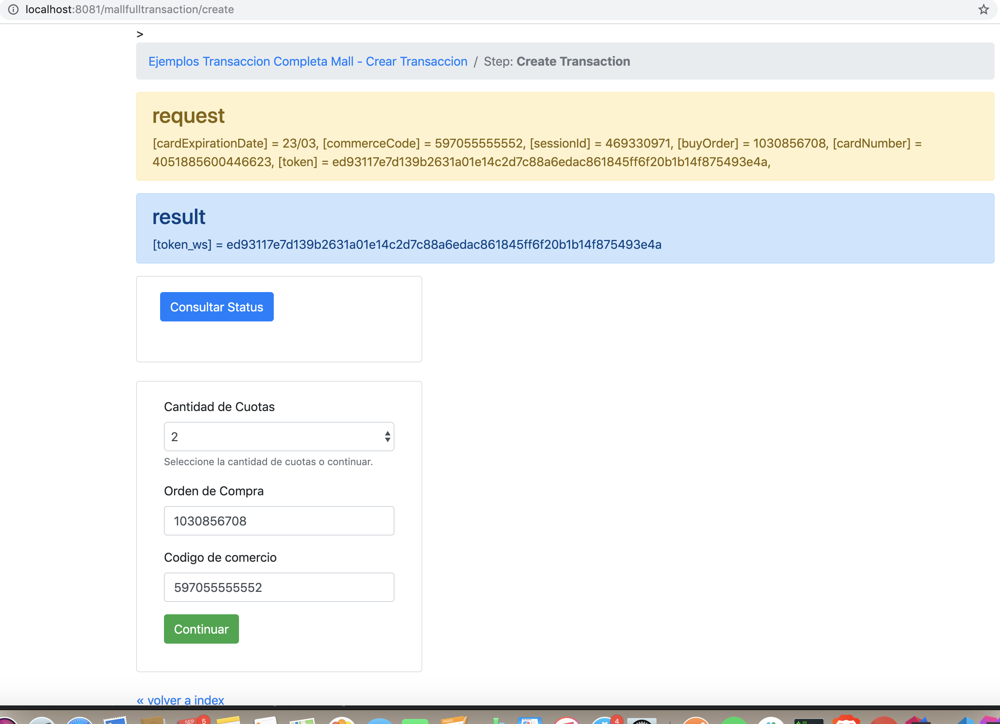
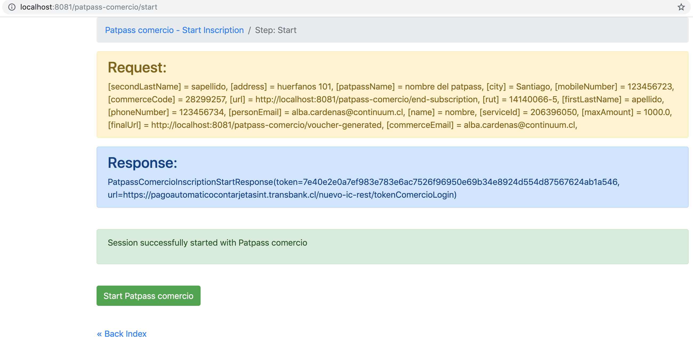

Proyecto de ejemplo para uso del SDK Rest de Transbank para Java
--

El siguiente proyecto es una simulacion de un ecommerce el cual utiliza los distintos servicios de webpay rest a traves del SDK de Transbank para java


## Requerimientos
Para ejecutar el proyecto es necesario tener: 
 ```docker```  ([como instalar Docker](https://docs.docker.com/install/))

## Clonar o bajar proyecto desde github

([transbank-sdk-java-webpay-rest-example-github](https://github.com/TransbankDevelopers/transbank-sdk-java-webpay-rest-example))

## Ejecutar ejemplo
Con el código fuente del proyecto en tu computador, puedes ejecutar en la raíz del proyecto el comando para construir el contenedor docker, si es la primera vez que ejecutas el proyecto:
```bash
./docker-build
```

Finalmente, para correr el proyecto de ejemplo:
```
./docker-run
```

Cuando quieras detener el docker simplemente corre el siguiente script en la raíz del proyecto:
```
./docker-stop
```

También puedes iniciar el proyecto simplemente ejecutando el archivo `./docker-run` en la raíz del proyecto

En ambos casos el proyecto se ejecutará en http://localhost:8080 (y fallará en caso de que el puerto 8080 no esté disponible)

Puedes mirar el SDK de Java aqui [SDK Rest Java](https://github.com/TransbankDevelopers/transbank-sdk-java)


## Index



## Webpay Plus



## Webpay Plus Mall



## Webpay Plus Captura Diferida



## Webpay Plus Mall Captura Diferida



## Oneclick Mall



## Transaccion Completa



## Patpass Webpay



## Transaccion Completa Mall



## Patpass Comercio




